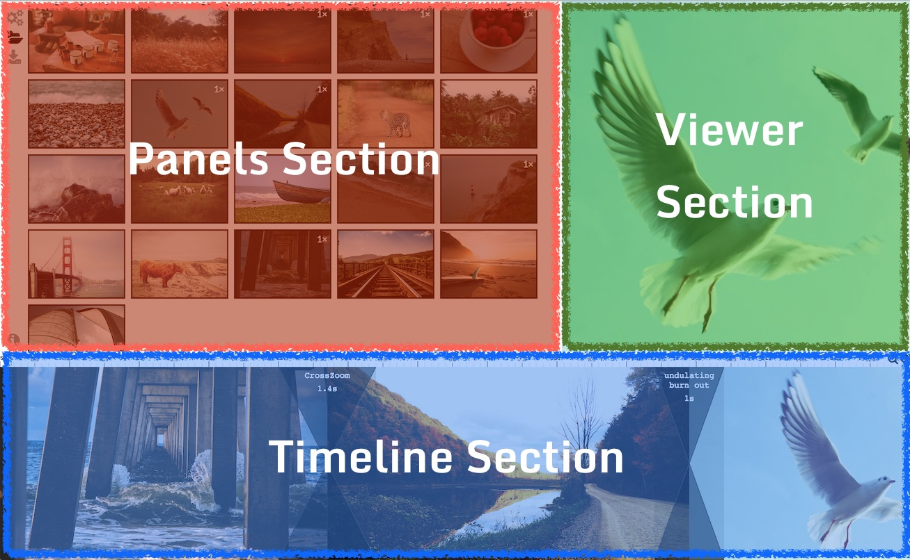
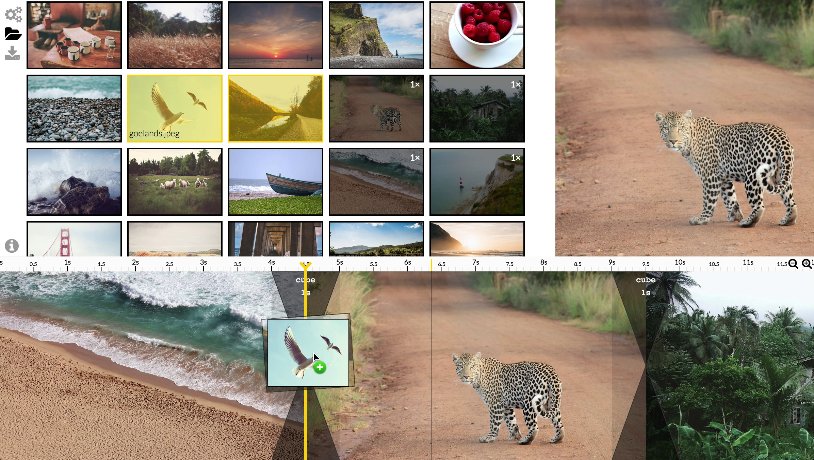
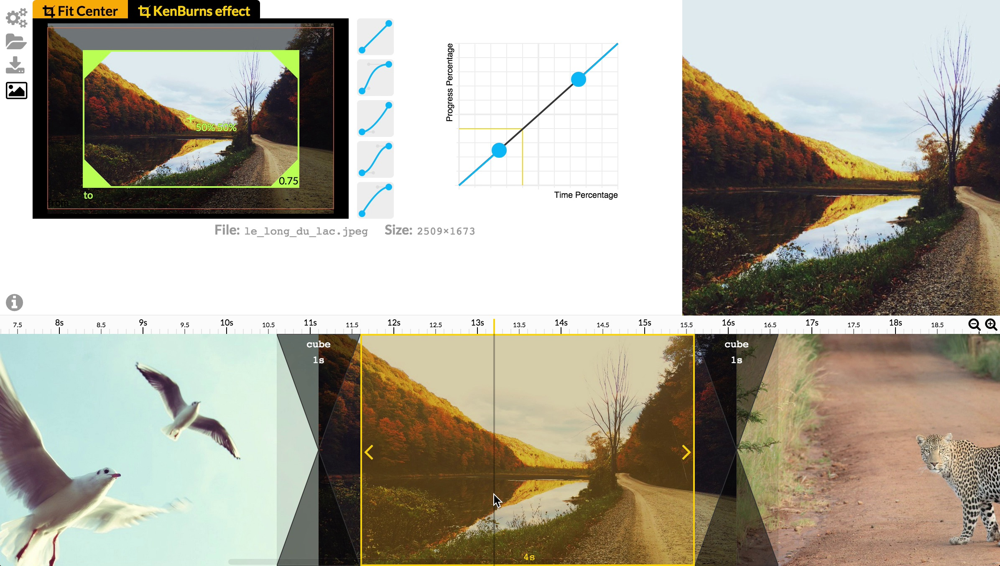

# Getting Started

*Diaporama Maker* have 3 sections: at the top-left stand the **Panels Section**, at the bottom the **Timeline Section**, on top-right the **Viewer Section** (overview of your work).

*Diaporama Maker* have multiple panels (displayed in the **Panels Section**). Each panel focus on one part of the slideshow you are build.

Here is an overview of the features,
open dedicated documentation for each Section / Panel for more information.

Create your own Timeline
========================

Add KenBurns effects
====================

Customize Transitions
=====================

Download the Web Slideshow, ready to embed
==========================================

