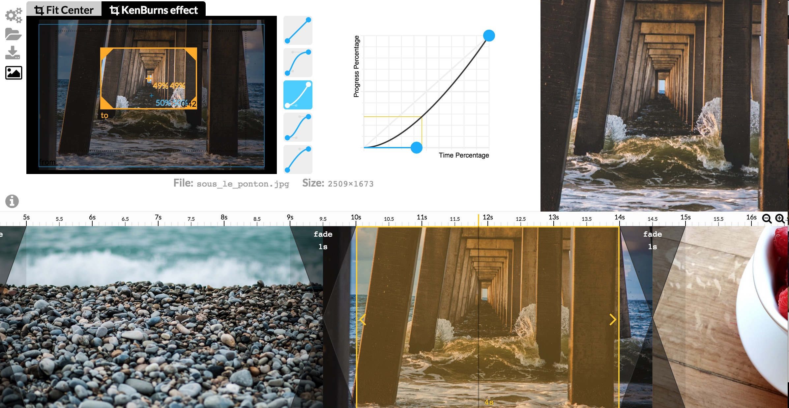
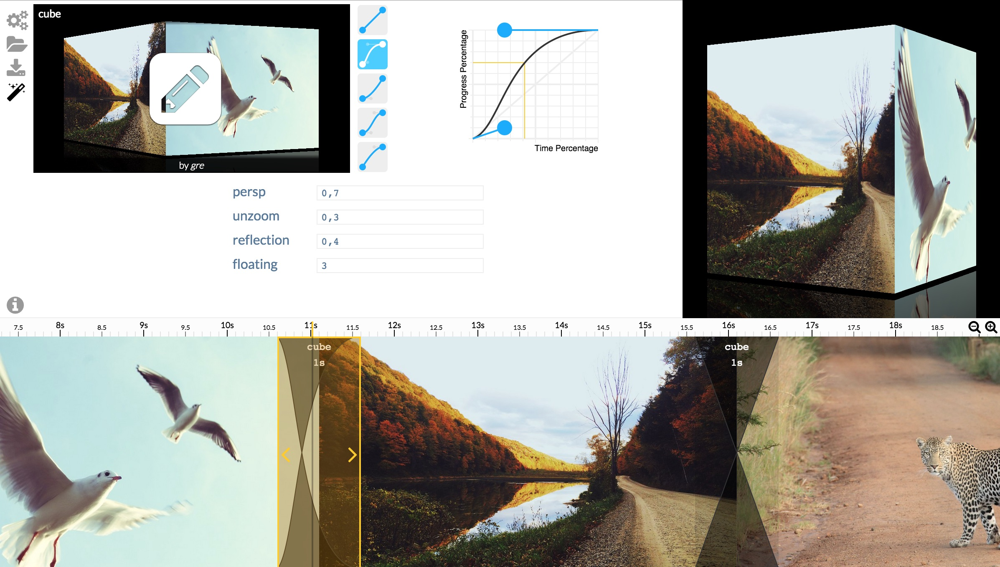
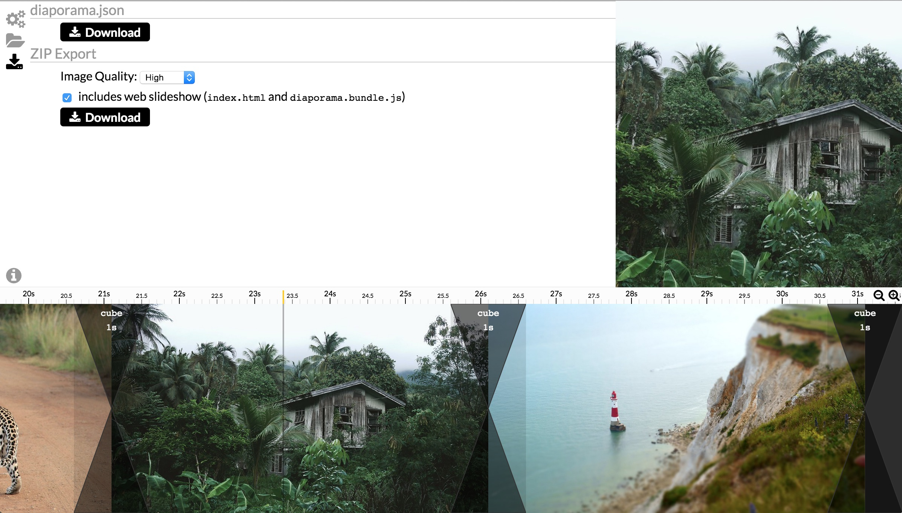

# Getting Started

***Diaporama Maker*** always works with a **working directory**.
You have to provide a directory on which to work (images of that directory will be used).

### **If using the command line,** you have to give the directory in parameter:

```
diaporama directory_with_images
```

### **If using the native application,** you will be asked to select a directory:

> **N.B:** the native application is not yet available.

<!-- add a screenshot -->


## Diaporama Maker Interface

*Diaporama Maker* have 3 sections: at the top-left stand the **Panels Section**, at the bottom the [**Timeline Section**](timeline.md), on top-right the [**Viewer Section**](viewer.md) (overview of your work).


*Diaporama Maker* have multiple panels (displayed in the **Panels Section**).
Each panel focuses on one part of the slideshow you are building.


Create your own Timeline
========================

See [Library Panel](library.md) for more information on the Library.

See [Timeline Section](timeline.md) for more information on the Timeline.


Add KenBurns effects
====================

See [Image Panel](image.md) for more information.



Customize Transitions
=====================

See [Transition Panel](transition.md) for more information.



Download the Web Slideshow, ready to embed
==========================================

See [Export Panel](export.md) for more information.


