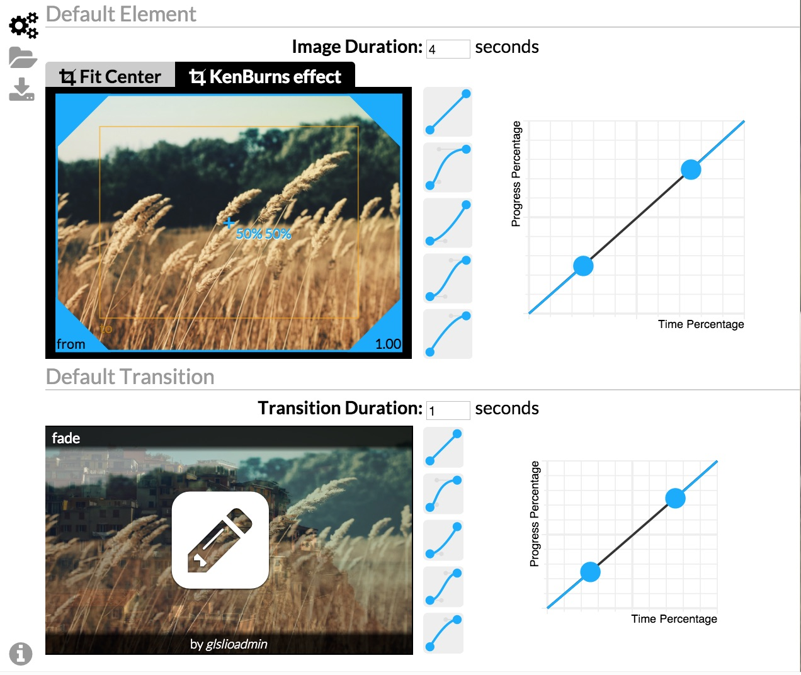

Configuration Panel
===================

This panel allows to configure the defaults of the Diaporama Editor.

- You can configure the default image configuration (like in [Image Panel](image.md)).
- You can configure the default transition configuration (like in [Transition Panel](transition.md)).
