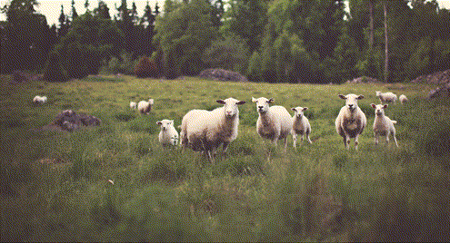
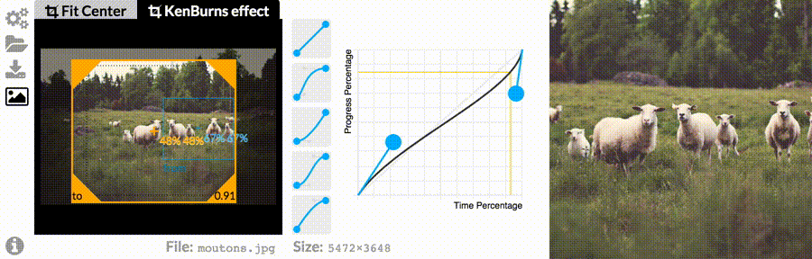

# Image Panel

The Image Panel allows to configure the crop settings of a selected image in the Timeline.

## 2 kind of crops

### Fit Center

**Fit Center** makes the image to the fit the best viewport size.
> Unless both the image and the viewport have the same ratio, the image need to be cropped in order to preserve its aspect ratio.

### KenBurns Effect

This enable an animated crop effect (zooming, panning,...), conventionally called the "kenburns effect". See following example GIF:

There is currently 2 parts to configure the effect: **the origin/destination center and zoom** and **the animation easing**.

## center and zoom

On the left you can configure the kenburns effects
by controlling the center and the zoom of the **origin** and the **destination** crop.

- The Blue rectangle controls the origin crop.
- The Yellow rectangle controls the destination crop.

Drag with the mouse to move and resize the rectangle.
Click anywhere to alternate between the rectangles.

## Animation Easing

On the right, the curve controls the easing you want (for instance you could make the effect accelerating and slowing down).
