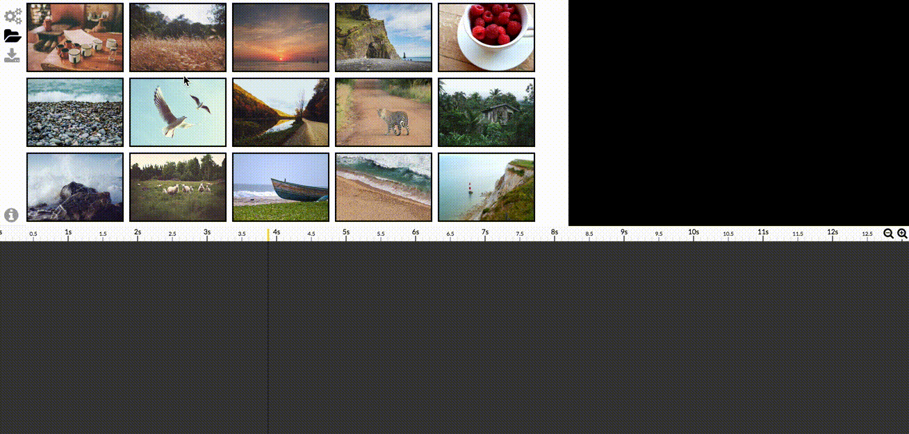

# Library Panel

The library lists all items extracted from the working directory.

There are only **Image** items supported in the current *Diaporama Maker* version.

## Library Item

Here are 4 Image items:

- The 2 first items are shown normally which means they have not been used yet in the current slideshow Timeline.
- The 2 last images are displayed with a dark opacity and a counter (`4x`, `1x`) which indicates how much it has been used in the current slideshow Timeline.

## Drag to Timeline

You can add Library images to your timeline using Drag And Drop.

You can also use the mouse to select multiple Library items, then Drag and Drop that selection to the desired Timeline place:

## Drop an Image to the Library

[This feature is not yet implemented](https://github.com/gre/diaporama-maker/issues/26)
