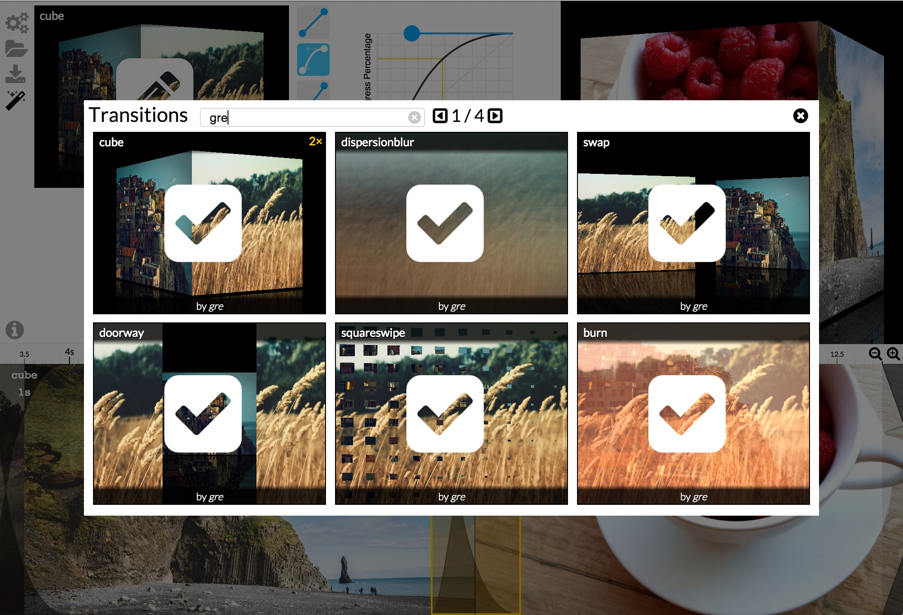
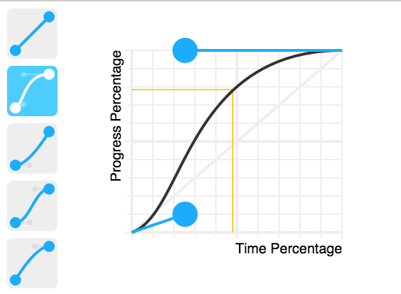

# Transition Panel

The Transition Panel allows you to configure the transition between two timeline slides.


A Transition is defined by 3 things:
- **the transition name**. picked from  that uses the transitions defined on [GLSL.io](http://glsl.io).
- **the transition easing**. defined by the bezier curve on the right.
- **the transition parameters** (technically called uniforms).
- **the transition duration**: This can be resized on the [**Timeline**](timeline.md).


## Pick a Transition

Simply click on .
and select the transition you like by clicking on .
You can search by name or by author in the search field.




## Configure the Easing

Pick one of the rectangle, or configure precisely the curve with the 2 handles.



## Configure the parameters

A Transition might have some parameters
*(constant that is defined and used by the transition implementation)*.

There are always default parameters provided, but you can change them
to customize the transition effect using the inputs.

## Technical format

**Here is what the first screenshot example defines in the JSON:**

```json
{
  "name":"cube",
  "uniforms": {
    "persp": 0.7,
    "unzoom": 0.3,
    "reflection": 0.4,
    "floating": 3
  },
  "easing": [0.25,0.1,0.25,1],
  "duration":1000
}
```

> Note that `"cube"` is the *id* of the transition. The final `diaporama.json` will inline the source code of the transition in GLSL.
