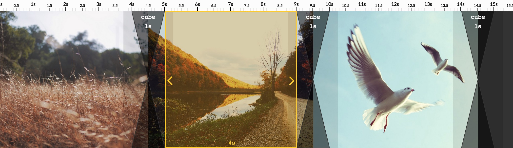

# Timeline Section

The **Timeline** displays your slideshow on a time axis.

You can see on top a **Time Scale** with ** Zoom Controls**, and then the **Slides** that can be separated by **Transitions**.

A cursor is also displayed that shows the current Viewer time.

## Slides

> For now, there is only one kind of slide you can define: the **Image** slide. In the future, there might also be the content slide (e.g; putting texts) and the video slide!

### Add new Image Slides
To add new images, Drag and Drop them from the Library.

### Select a Slide

To Select a Slide, simply Click on it.

Selecting a slide will open the related slide Panel: for an image, the **Image Panel**.

> You can change the selected slide by pressing Left and Right arrows.

### Remove a Slide

To remove a slide, select it, then press **Delete** (or **Backspace**).

### Re-order a Slide

To reorder slides, simply Drag and Drop in the Timeline.

> You can also use **C-Left** and **C-Right** hotkeys to move a selected slide.

### Resize a Slide

To resize a Selected Slide, drag one of the Orange Arrow:

## Transitions

### Add a Transition

To add a Transition, simply click on the  button.

### Select Transition

Exactly like for Slides, you can also select a Transition.

It will open the **Transition Panel** that allow to customize it.

It also allows to **Resize it** and **Remove it**.
